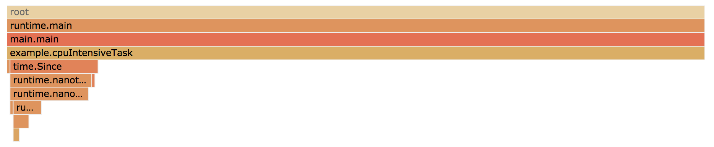
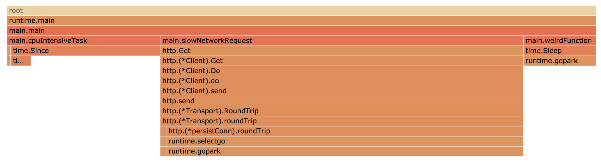

footer: Felix Geisendörfer - :wave: Say hello on Twitter: @felixge
autoscale: true

# :rocket: fgprof

## The Full Go Profiler

^ Thank organizers

---

# Why is this program slow?

```go
func main() {
	for {
		// Http request to a web service that might be slow.
		slowNetworkRequest()
		// Some heavy CPU computation.
		cpuIntensiveTask()
		// Poorly named function that you don't understand yet.
		weirdFunction()
	}
}
```

---

# Wrap every call in a time tracking function

```go
func main() {
	for {
		// Http request to a web service that might be slow.
		timeFn("slowNetworkRequest", slowNetworkRequest)
		// Some heavy CPU computation.
		timeFn("cpuIntensiveTask", cpuIntensiveTask)
		// Poorly named function that you don't understand yet.
		timeFn("weirdFunction", weirdFunction)
	}
}

func timeFn(name string, fn func()) {
	start := time.Now()
	fn()
	log.Printf("%s took %s", name, time.Since(start))
}
```

---

# :tada: We just build a tracing profiler :smile:

* But it's annoying that we had to explicitly instrument our code
* Some tracing profilers in e.g. Ruby or Python can wrap all your functions for you automatically, but they can slow your program by 2-3x.
* So if we're lazy people who want it all (no work, low overhead), what can we do?

---

# How do sampling profilers work?

* For some duration, e.g. 10 seconds:
	* Stop program 100 times per second and record the current call stack(s)
* Afterwards
	* Count how many times each call stack was seen
	* At 100 Hz, each time a stack is seen is assumed to have lasted 10ms
	* Visualize or report the results

---

# Using Go's builtin CPU profiler

```go
import _ "net/http/pprof"

func main() {
	go func() {
		log.Println(http.ListenAndServe(":6060", nil))
	}()

	// <code to profile>
}
```

```
$ go tool pprof -http=:6061 \
	http://localhost:6060/debug/pprof/profile?seconds=10
```

---

# Go's profiler only shows *On-CPU* Time :cry:



---

# Using fgprof

```go
import _ "net/http/pprof"
import "github.com/felixge/fgprof"

func main() {
	http.DefaultServeMux.Handle("/debug/fgprof", fgprof.Handler())
	go func() {
		log.Println(http.ListenAndServe(":6060", nil))
	}()

	// <code to profile>
}
```

```
$ go tool pprof -http=:6061 \
	http://localhost:6060/debug/fgprof?seconds=10
```

---

# :rocket: fgprof shows *On-CPU* **and** *Off-CPU* Time



---

# How Go's profiler works (on unixy systems)

* Uses `setitimer(2)` to ask the kernel to send SIGPROF signals to our program 100 times per second.
* These signals stop the program and are received by random OS threads used by the Go runtime.
* The signaled thread records it's current call stack for later aggregation and output.
* But since Go uses non-blocking I/O internally, OS threads are never blocked on e.g. read/write system calls. Goroutines waiting for I/O are "parked" until `epoll()` has new events for them. This makes them **invisible** to the builtin profiler.

---

# How the fgprof profiler works

* Spawns a background goroutine that wakes up 99 times per second.
* On each wakeup it calls `runtime.GoroutineProfile()`, which briefly "stops the world", to provide a list of all goroutines and their stacks.
* The result is aggregated in an internal data structure for later output.
* `runtime.GoroutineProfile()` also includes Goroutines that are "parked" while waiting for I/O, so they are **visible** to fgprof.
* It's less than 100 lines of code, you should check it out : )

---

# Not enough time for ... :cry:

- fgprof Overhead (it's similar to Go's profiler)
- fgprof Accuracy (it's sometimes better than Go's profiler)
- Why nobody has done this before (probably lack of async preemption until Go 1.14)
- Related work on profiling Go code using Hardware Performance Monitoring Counters by Milind Chabbi

---

# Thank you for your time!

## Please ask Questions : )
