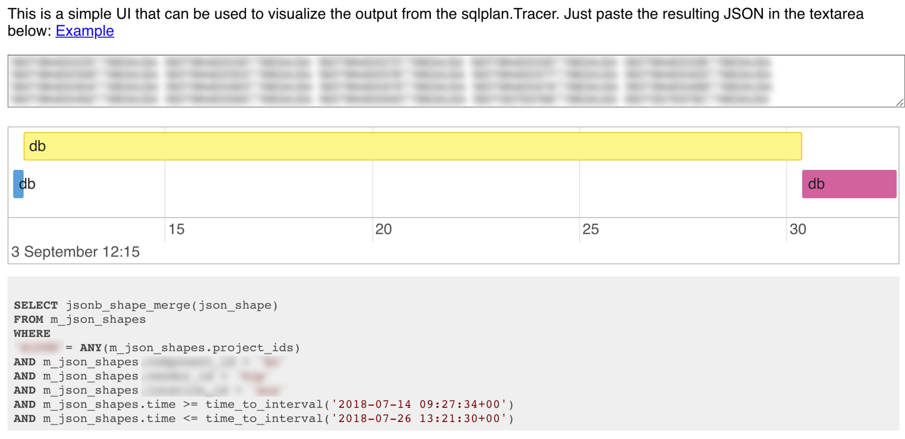
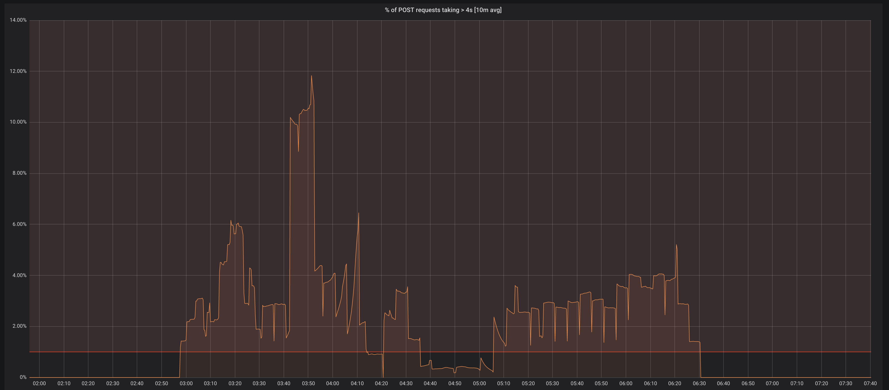
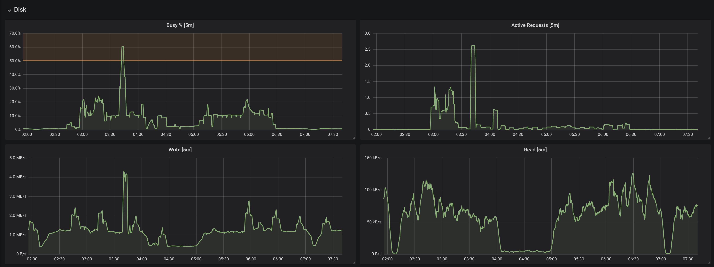

autoscale: true
slidenumbers: true
slidecount: true

# Scaling PostgreSQL

## 3 Years of Learnings in 60min

---

# Felix Geisendörfer

---

# Past

- CakePHP Core Contributor
- Node.js Core Contributor
- Startup Co-Founder (transloadit.com)
- Drone Enthusiast (nodecopter.com)

---

# Present

- Contractor for Apple since 2014
- Go / PostgreSQL Backend Developer
- Backend Team Leader
- DevOps / DBA Imposter

---

# In this talk

- What we learned in the last 3 years
- ~50 servers running postgres 9.6/10
- ~1000 transactions / s on a single machine
- Biggest table has 2 billion rows with 2.5 TB of data

---

# Not in this talk

- Employer Secrets
- Silver Bullets
- All Details (but many links for further reading)

---

# Audience

- Used PostgreSQL?
- Optimized SQL queries?
- Setup a PostgreSQL server?

---

# 3 Years Ago

---

# Couchbase (3.x)

- Membase (memcached) + CouchDB
- Promised to solve all our BigData (TM) problems
- Lacked critical features (SQL, Transactions, JOINs, etc.)
- Poor performance (Index creation 10x slower than PostgreSQL)
- Very hard to debug

---


# Couch on Fire

- No JOINs
- Forced N+1 Anti-Pattern
- Server slowed to a crawl
- Restart "fixed" it
- No clue in 20+ log files
- Probably TCP/IP / Congestion Control / SYN-Cookie related
- Studied tcpdumps and Linux Kernel Source 🤦🏻‍♂️

---


---

# PostgreSQL

- Focused on good engineering rather than marketing/sales (unlike MySQL, MongoDB, Oracle, etc.)
- Adaptable to a large range of workloads and use cases yet surprisingly performant
- Many resources online, you can google your way out of most problems in minutes

---

# Choose a Transaction Isolation Level

- Most people don't and end up with the default (Read committed), this happened to us 🙋🏻‍♂️
- Unforuntately any level other than `serializable` is notoriously difficult to reason about and opens the doors to bugs and security exploits [^1]

[^1]: https://blog.acolyer.org/2017/08/07/acidrain-concurrency-related-attacks-on-database-backed-web-applications/

---

# Read Commited Example

```sql
BEGIN;
SELECT balance FROM accounts WHERE user_id = 1;
100
SELECT balance FROM accounts WHERE user_id = 1;
230
SELECT balance FROM accounts WHERE user_id = 1;
0
```

😱

---

# Transaction Isolation

This is a complex topic and I recommend studying it carefully.

See Martin Kleppmann's excellent work[^2] on the subject for more information, and also read his book[^3], it's amazing.

[^2]: https://martin.kleppmann.com/2014/11/25/hermitage-testing-the-i-in-acid.html

[^3]: http://dataintensive.net/

---

# Application Architecture

---

# Traditional Application Architecture

1. client-\>app: `GET /posts`
2. app-\>db: `SELECT * FROM posts`
3. db-\>app: `
	(1, 'Post 1', '2018-09-01T01:00:00')
	(2, 'Post 2', '2018-09-01T02:00:00')`
4. app: map SQL rows to domain objects (models), then convert object array to JSON
5. app-\>client: `[
		{"id":1,"title":"Post 1","created":"2018-09-01T01:00:00"}, 
		{"id":2,"title":"Post 2","created":"2018-09-01T02:00:00"}
	]`

---

# SQL-First Approach

1. client-\>app: `GET /posts`
2. app-\>db: `SELECT json_agg(posts) FROM posts;`
3. db-\>app: `[
		{"id":1,"title":"Post 1","created":"2018-09-01T01:00:00"}, 
		{"id":2,"title":"Post 2","created":"2018-09-01T02:00:00"}
	]`
4. app-\>client: `[
		{"id":1,"title":"Post 1","created":"2018-09-01T01:00:00"}, 
		{"id":2,"title":"Post 2","created":"2018-09-01T02:00:00"}
	]`

---

## SQL-First Approach

- Less code (duplication) because there is no need to redefine DB table structure as application domain objects (models)
- Better performance due to reduced data marshaling
- Potential solution to the object/relational mismatch, aka the vietnam of computer science[^4]

[^4]: https://blog.codinghorror.com/object-relational-mapping-is-the-vietnam-of-computer-science/

---

# Another SQL-First Example

```json
[
  {
    "id": 1,
    "title": "Post 1",
    "created": "2018-09-01T01:00:00",
    "comments": [
      {
        "id": 1,
        "post_id": 1,
        "comment": "Comment 1",
        "created": "2018-09-02T01:00:00"
      },
      {
        "id": 2,
        "post_id": 1,
        "comment": "Comment 2",
        "created": "2018-09-02T02:00:00"
      }
    ]
  },
  ...
]
```

---

# Another SQL-First Example


```sql
SELECT json_agg(json_build_object(
	'id', posts.id,
	'title', posts.title,
	'created', posts.created,
	'comments', (
		SELECT json_agg(comments)
		FROM comments
		WHERE comments.post_id = posts.id
	)
))
FROM posts;
```

---

# SQL First Debugging

In our system you can append a `?debug=sql` to any URL to get some JSON that can be visualized in a tool we wrote:



---

# More SQL First

Go beyond SQL-92! [^5]

- Window functions
- User defined aggregates[^6]
- Lateral JOINs
- CTEs (`WITH` / `WITH RECURSIVE`)
- etc.

[^5]: https://www.slideshare.net/MarkusWinand/modern-sql

[^6]: http://felixge.de/2017/07/27/implementing-state-machines-in-postgresql.html

---

# Tuning your Database Server

There are two ways:

- Cargo Cult: PGTune[^7]
- Trial & Error

Both can be acceptable, but Trial & Error will lead to a deeper understanding of the database settings and how they relate to your workload.

[^7]: https://pgtune.leopard.in.ua/#/

---

# Tuning: `shared_buffers`

* Controls the size of PostgreSQL own page cache
* This is a second cache layer on top of Linux' own disk cache
* Mentioned in every guide as very important
* Had very little impact for most of our workload, with one exception (YMMV)

---

# Tuning: `work_mem`

* Controls how much memory PostgreSQL may use to execute a single query
* The default is very low (`4MB`) and may lead to sub-optimal query plans that spill sorts to disk
* Had a large impact (2-3x) on some of our aggregate queries (e.g. GROUP BY on a high cardinality column)

---

# Tuning: `work_mem`

```sql
-- Find the user with the most comments
EXPLAIN ANALYZE
SELECT
	user_id,
	count(*) AS count
FROM comments
GROUP BY 1
ORDER BY 2 DESC
LIMIT 1;
```

---

# Tuning: `work_mem` (4MB)

```
Limit  (cost=136753.35..136753.36 rows=1 width=14)
(actual time=13941.562..13941.565 rows=1 loops=1)
  ->  Sort  (cost=136753.35..137002.69 rows=99734 width=14)
  (actual time=13941.547..13941.547 rows=1 loops=1)
        Sort Key: (count(*)) DESC
        Sort Method: top-N heapsort  Memory: 25kB
        ->  GroupAggregate  (cost=127757.34..136254.68 rows=99734 width=14) 
        (actual time=6836.333..13613.377 rows=100001 loops=1)
              Group Key: user_id
              ->  Sort  (cost=127757.34..130257.34 rows=1000000 width=6)
              (actual time=6836.258..9976.348 rows=1000000 loops=1)
                    Sort Key: user_id
                    Sort Method: external sort  Disk: 16440kB
                    ->  Seq Scan on comments  (cost=0.00..14425.00 rows=1000000 width=6)
                    (actual time=0.072..3126.210 rows=1000000 loops=1)
Planning time: 0.089 ms
Execution time: 13945.117 ms
```

---

# Tuning: `work_mem` (16MB)

```
Limit  (cost=20921.01..20921.01 rows=1 width=14)
(actual time=7267.160..7267.163 rows=1 loops=1)
  ->  Sort  (cost=20921.01..21170.35 rows=99734 width=14)
  (actual time=7267.149..7267.149 rows=1 loops=1)
        Sort Key: (count(*)) DESC
        Sort Method: top-N heapsort  Memory: 25kB
        ->  HashAggregate  (cost=19425.00..20422.34 rows=99734 width=14)
        (actual time=6548.502..6912.868 rows=100001 loops=1)
              Group Key: user_id
              ->  Seq Scan on comments  (cost=0.00..14425.00 rows=1000000 width=6)
              (actual time=0.083..3131.811 rows=1000000 loops=1)
Planning time: 0.061 ms
Execution time: 7268.675 ms
```

---

# Tuning: Autovacuum

* Controls how often and fast PostgreSQL cleans dead rows
* Also controls how often statistics and visibility map get updated
* Default settings can be too low for a busy server. E.g. tables only get cleaned after > 20% of the rows are dead, and cleanup only happens at 8 MB/s (read) and 4 MB/s (write)[^8]. So a 1 TB table won't be cleaned until it contains 200 GB of garbage, and the cleaning will take ~50 hours.
* We tuned: `autovacuum_vacuum_cost_limit`, `autovacuum_max_workers`, `autovacuum_vacuum_scale_factor` and `autovacuum_analyze_scale_factor`

[^8]: https://blog.2ndquadrant.com/autovacuum-tuning-basics/

---

# Tuning: Autovacuum Pitfall 🤕

* Automatic Vacuuming is triggered exclusively by dead rows
* An append-only table will never have dead rows
* This means this table will also not get statistics collected and is likely
  to experience very bad query plans.
* You'll have to manually vacuum such tables yourself, perhaps using CRON 😢

---

# Hardware

* Buy the best hardware you can, it's much cheaper than wasting the time of your best developers on squeezing the last drops of performance out of slow hardware
* You want lots of memory and fast SSDs
* New versions of PostgreSQL have also gotten much better at leveraging multi-core systems.
* FWIW our largest servers now have 28 cores, 256 GB of memory, and 32 TB of SSD storage

---

# Query Optimization

A quick guide what we usually do when dealing with a slow query.

1. Visualize the query plan[^9] [^10]
2. Identify and fix bad estimates (`VACUUM ANALYZE`, `CREATE STATISTICS`, `default_statistics_target`, etc.)
3. Put parts of your query inside a CTE (`WITH` statement) which acts an optimization barrier.
4. Experiment with with planner configs (e.g. `SET enable_seqscan=false;`), but avoid using them in production

[^9]: https://explain.depesz.com/ - An oldie but a goldie, I find it the most useful

[^10]: http://tatiyants.com/pev/#/plans - A new contender with much nicer visualization, but IMO less useful

---

# Materialized Views

- Main idea: Materialize the answers to your queries ahead of time
- Most powerful technique for speeding up aggregate queries processing large numbers of rows

---

# `CREATE MATERIALIZED VIEW`

- Built-in and easy to use
- Basically executes a query once and stores the result in a new "table"
- Downside: Doesn't update automatically and can't be updated incrementally

---

# `CREATE MATERIALIZED VIEW`

```sql
-- This is part of the query from our previous example
CREATE MATERIALIZED VIEW comment_counts AS
SELECT
	user_id,
	count(*) AS count
FROM comments
GROUP BY 1;
```

---

# `CREATE MATERIALIZED VIEW`

```sql
-- This uses our new materialized view
-- to find the user with the most comments
EXPLAIN ANALYZE
SELECT user_id, count
FROM comment_counts
ORDER BY 2 DESC
LIMIT 1;
```

---

# `CREATE MATERIALIZED VIEW`

```
Limit  (cost=2041.02..2041.02 rows=1 width=14)
(actual time=632.329..632.332 rows=1 loops=1)
  ->  Sort  (cost=2041.02..2291.02 rows=100001 width=14)
 (actual time=632.319..632.319 rows=1 loops=1)
        Sort Key: count DESC
        Sort Method: top-N heapsort  Memory: 25kB
        ->  Seq Scan on comment_counts  (cost=0.00..1541.01 rows=100001 width=14)
        (actual time=0.013..314.874 rows=100001 loops=1)
Planning time: 0.095 ms
Execution time: 632.368 ms
```

10x faster than before!

---

# Materialized Views using Triggers

- Use triggers to keep your rollup table updated
- Allows our rollup table to stay updated in real-time
- Requires a little more work than `CREATE MATERIALIZED VIEW`, but it's managable, especially for append-only tables.

---

# Materialized Views using Triggers

```sql
CREATE TABLE comment_counts (
	user_id int PRIMARY KEY,
	count int
);

CREATE OR REPLACE FUNCTION after_insert() RETURNS TRIGGER LANGUAGE plpgsql AS $$
BEGIN
	INSERT INTO comment_counts (user_id, count)
	VALUES (NEW.user_id, 1)
	ON CONFLICT (user_id) DO UPDATE
	SET count = comment_counts.count + 1;
	RETURN NEW;
END
$$;

CREATE TRIGGER trg_insert AFTER INSERT ON comments FOR EACH ROW EXECUTE PROCEDURE after_insert();
```

---

# Materialized Views using Triggers

There are even more advanced techniques available, and I highly recommend reading Jack Christensen's post[^11] about it. It was this post that convinced me that building scalable real-time analytics applications with PostgreSQL is doable.

[^11]: https://hashrocket.com/blog/posts/materialized-view-strategies-using-postgresql

---

# GIN Indexes: Array


---

# GIN Indexes: JSON (jsonb\_ops)


---

# How Postgres has failed us

---

# Requests piling up

- Our backend uses a connection pool (`database/sql` from Go stdlib), but we had no timeout on aquiring connections
- When our DB got overloaded (due to a mis-behaved client DoS'ing it) requests started piling up
- Each request used a file descriptor for its socket -> system ran out of FDs, everything came to a gnarling halt 🤕
- Not Postgres fault, but perhaps a common failure scenario
- Solution: Reject requests if there are too many pending ones

---

# Operator Error

- One of our DevOps team members ran a `CREATE INDEX` query against the wrong server
- This locked a busy table, causing lots of requests to timeout/fail
- Again: Not Postgres fault, but common scenario
- Solution: Be more careful

---

# Long running queries

- One of our data analysts started a long-running query that ran for > 24h
- This caused one of our update-heavy tables to become very bloated and queries against it to slow down significantly
- Solution: Separate OLAP from OLTP environments using logical replication

---

# Full Disks

- We use replication slots to avoid our primary servers from throwing away WAL segments that are still needed by a temporarely disconnected replica
- But when a replica doesn't come back soon, WAL segments on the primary pile up
- We had a few close calls where this happened
- But thanks to monitoring we were notified early
- Solution: Monitoring and drop replication slots if you have to

---

# GIN Index Pending List


---

# GIN Index Pending List

- Root cause: GIN indexes use a pending list to speed up updates, and this list grows until a certain point, then reset back to 0
- As the list fills, query lookups become slower
- Solution: Set `fastupdate = off` for the index

---

# Latency Spikes



---

# Latency Spikes



---

# Latency Spikes

- Large number of slow requests correlated to high disk busyness
- But Read/Write throughput way below theoretical disk capabilities
- Root Cause: Broken HW (RAID Controller or Disk)
- Solution: Failover to spare machines

---

# Deadlocks

- We're using `INSERT INTO ... SELECT ... ON CONFLICT ... DO UPDATE` heavily for trigger based materialization
- During some high-concurrent situations we'd see lots of these queries fail due deadlocks
- Root cause: TX 1 locks Row 1, TX 2 locks Row 2, TX 1 locks Row 2 (blocked), TX 2 locks Row 1 (blocked)
- Solution: Add `ORDER BY` to `SELECT` clause


---

# Migrations

- Make sure the schema of all your environments (local dev, staging, prod, etc.) stay in sync. [^11]
- Make sure your schema changes don't require downtime [^12]

[^11]: We are big fans of https://flywaydb.org/ for this.

[^12]: This post gives a good overview: https://www.braintreepayments.com/blog/safe-operations-for-high-volume-postgresql/ - but you should always read the docs carefully and test beforehand

---

# Replication

- We use streaming synchronous replication for data durability and redundancy
- We do not use automatic failover yet, it's tricky to do correctly and an incorrect implementation is far worse than none.
- We use logical replication to replicate data across WAN (less bandwidth), reduce coupling (queries on replica can't impact primary), and for ETL (using stored procedures)
- We love logical replication!

---

# Monitoring

What to monitor:

- Application Latency (e.g. % of requests taking >1s)
- Disk (Space Remaining, Busy %, Read/Write MB/s)
- Network (Send/Receive Mbps)
- Deadlocks (Should always be 0)
- Replication Lag

---

# Monitoring

Here is our stack:

- Prometheus as a time series DB
- Grafana for graphing and alerting
- postgres-exporter for collecting postgres metrics
- ELK stack for logging

---

# Monitoring

Here is our stack:

- Prometheus as a time series DB
- Grafana for graphing and alerting
- node-exporter[^13] for collecting machine metrics
- postgres-exporter[^14] for collecting postgres metrics

[^13]: https://github.com/wrouesnel/postgres_exporter

[^14]: https://github.com/prometheus/node_exporter

---

# Monitoring

What to monitor:

- Application Latency (e.g. % of requests taking >1s)
- Disk (Space Remaining, Busy %, Read/Write MB/s)
- Network (Send/Receive Mbps)
- Deadlocks (Should always be 0)

---

# Questions?

- Slides are at: https://github.com/felixge/talks
- Web: http://felixge.de/
- Twitter: http://twitter.com/felixge
- E-Mail: hi@felixge.de
